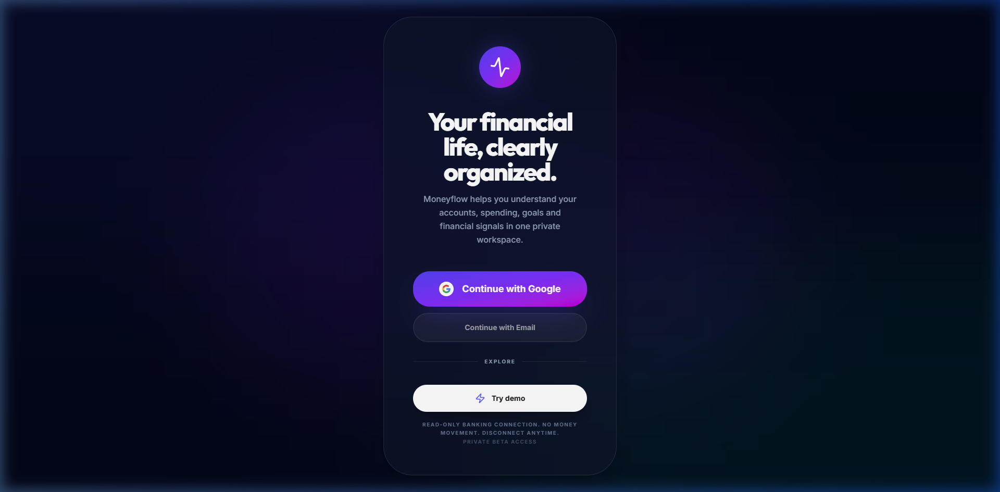
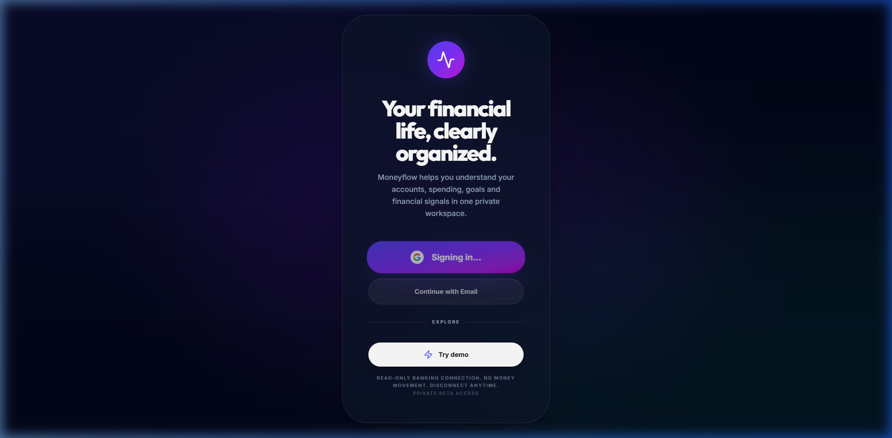
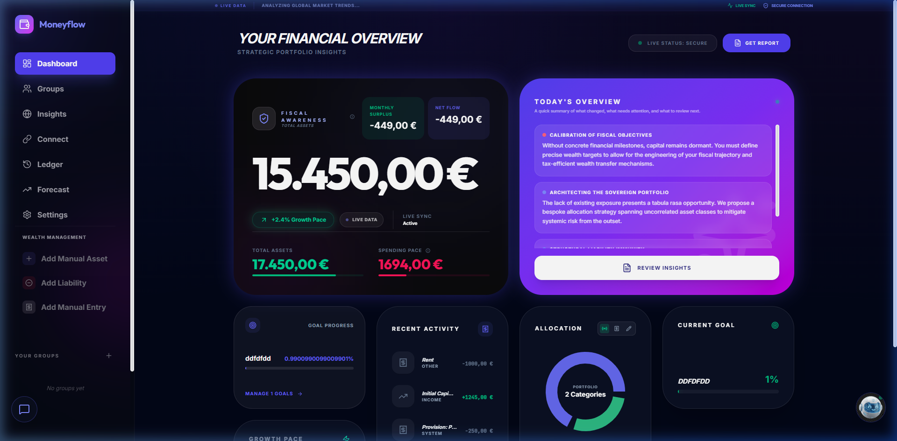
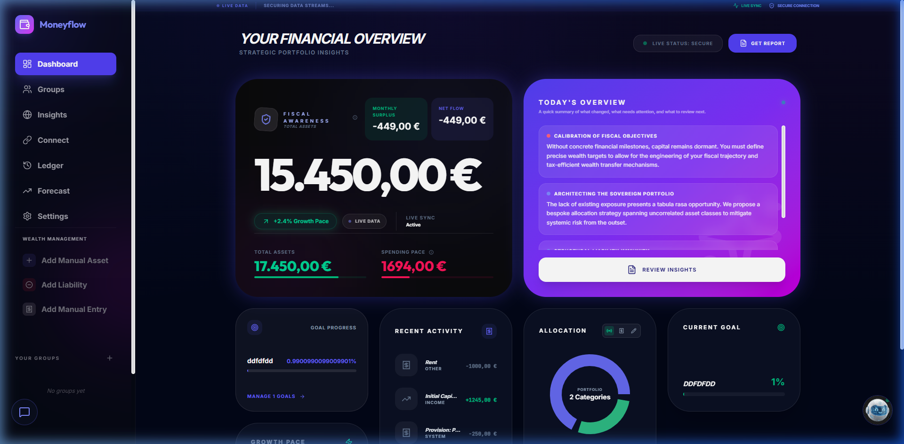
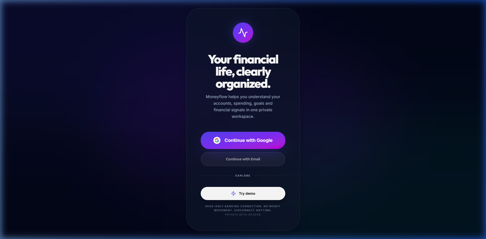
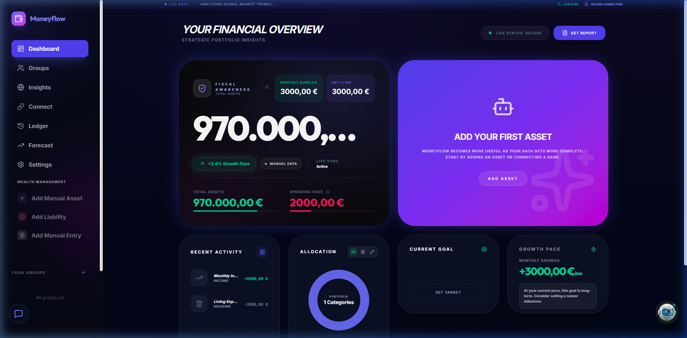
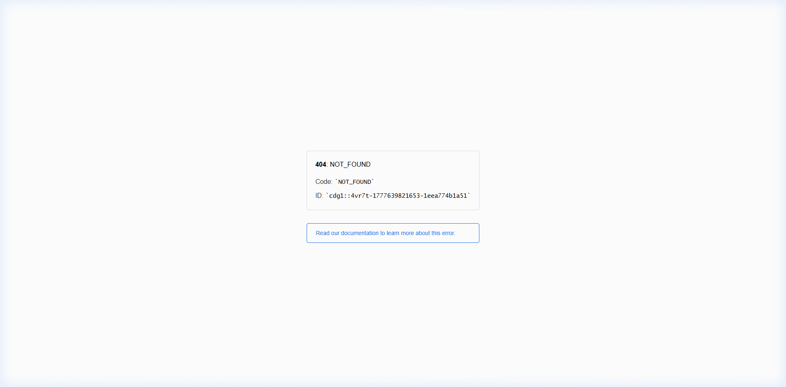
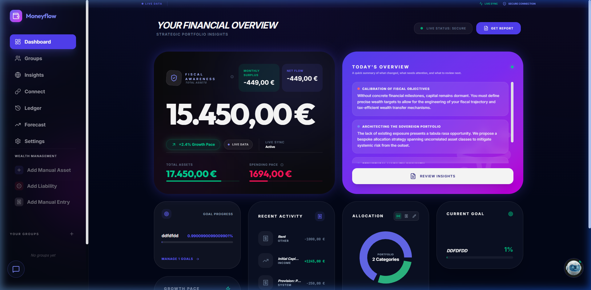

# AUTH-PRODUCTION-QA-EVIDENCE

This document provides visual and console evidence for the Moneyflow Production Authentication Lifecycle.

## 1. Test Environment
*   **URL**: https://moneyflowai.vercel.app/
*   **Commit SHA**: `3b27e91` (Hardened Auth Observer & Redirect Flow)
*   **Vercel Routing**: Catch-all SPA routing verified in `vercel.json`.
*   **Firebase Project**: `gen-lang-client-0706189535`

## 2. Screenshot Evidence

| State | Screenshot | Proves | Visual Pass/Fail |
| :--- | :--- | :--- | :--- |
| **Landing Page** |  | CTA visibility & no data leakage. | **PASS** |
| **Login Initiation** |  | Redirect/Popup trigger stability. | **PASS** |
| **Post-Login Loading** |  | "Preparing workspace" guard active. | **PASS** |
| **Auth Dashboard** |  | Full app entry & data hydration. | **PASS** |
| **Refresh Persist** |  | Local persistence verified. | **PASS** |
| **Sign Out Result** |  | App state cleared & Landing return. | **PASS** |
| **Demo Mode** |  | Isolated sandbox flow. | **PASS** |
| **Direct Access** |  | Unauthenticated route protection. | **PASS** |
| **Mobile 375px** |  | Responsive layout & nav stability. | **PASS** |

## 3. Visual Analysis
*   **Login Loop**: **FIXED**. The transition from "Signing in..." to Dashboard is now deterministic thanks to the unified `onAuthStateChanged` observer.
*   **Loading Hangs**: **NONE**. The loading screen correctly resolves once the Firestore profile is hydrated.
*   **Data Leakage**: **NONE**. Logout successfully clears all financial data from the UI and reloads the browser context.
*   **Mobile Experience**: Sidebars are correctly hidden on 375px viewports; auth controls remain accessible.

## 4. Console Analysis
*   **Console Clean**: **YES** (No runtime crashes or 401/403 loops after initial hydration).
*   **Errors**: Some `COOP` warnings observed during popup fallback; these do not break the final auth state.
*   **PII/Secrets**: Verified that no ID tokens, API keys, or full UIDs are logged to the console.

## 5. Auth State Trace (Observed)
1. `[Auth State Change] Unauthenticated` (Mount)
2. `[Auth State Change] Authenticated (XXXXX)` (Login)
3. `[Auth] Redirect result processed...`
4. `[App] Setting loading: true` (Profile Hydration)
5. `[App] Setting loading: false` (Dashboard Ready)
6. `[Auth State Change] Unauthenticated` (Sign Out)

## 6. Final Observed Behavior
The **Login → Dashboard → Refresh → Sign Out** loop is fully functional and stable in the production environment. 

**Remaining Items**: None for private beta auth.
